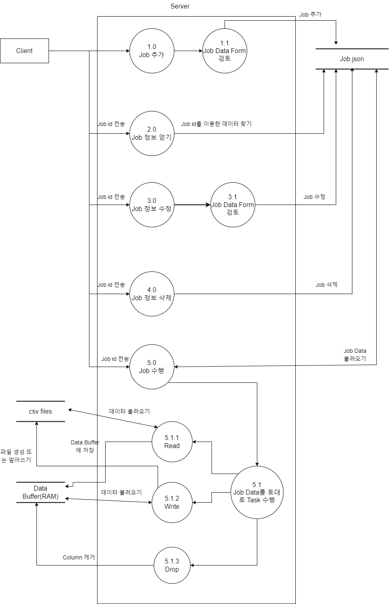
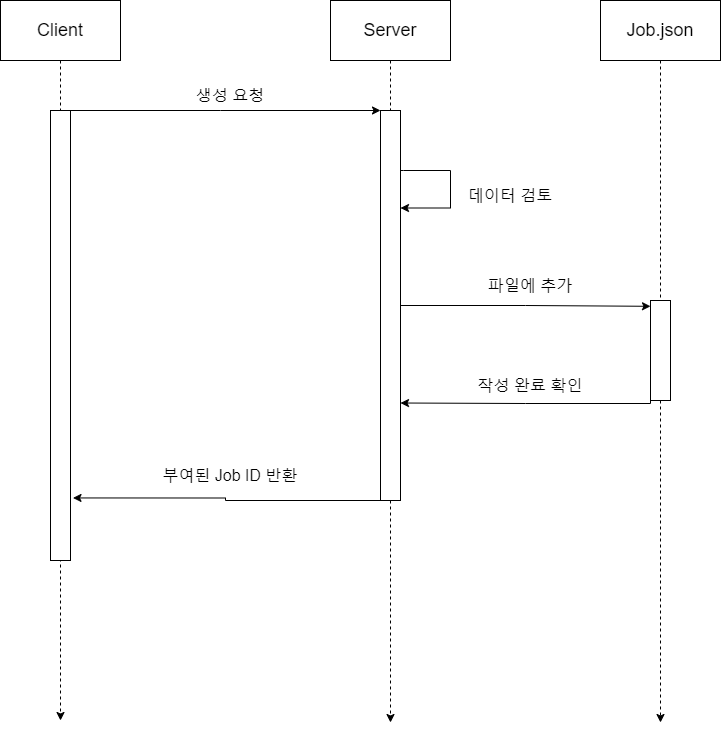
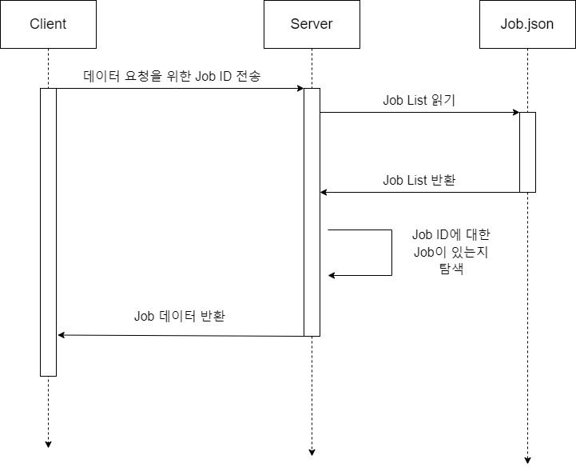
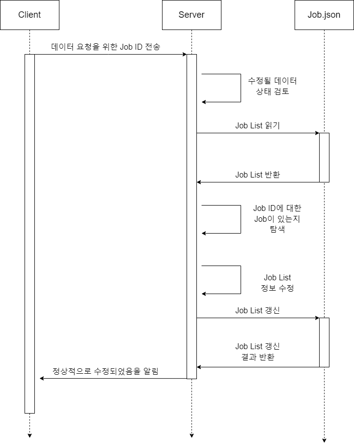
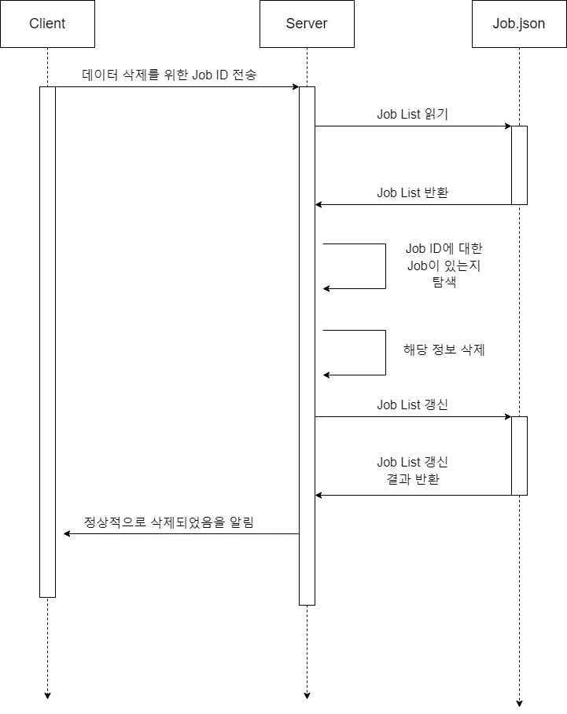
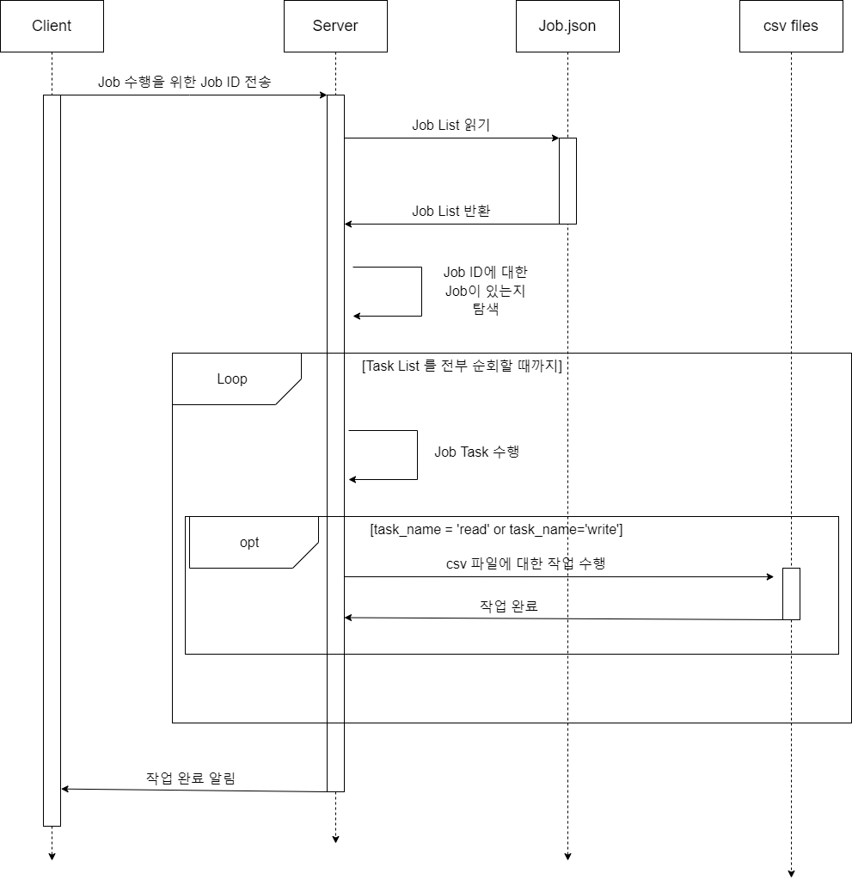

# wanted-2nd-moadata
2차 원티드 프리온보딩 - 모아데이타 기업 과제

<center>
<div style="display: flex">
    
    
    
    
</div>
</center>

## 개인별 링크
|이름|링크|프레임워크|
|---|---|---|
|최승리|[github](https://github.com/apollo058/Moadata_Django.git)|Django|
|하정현|[github](https://github.com/Vector-7/Moadata_Wanted)|Flask|
|남기윤|[github](https://github.com/Chilla-N/Moadata_Wanted/tree/main)|Flask|


## 요구사항
* 기존 요구 사항
  * JOB 저장: 입력받은 Job의 정보를 job.json파일에 저장
  * JOB 삭제: 입력 받은 job id를 job.json에 찾아 삭제 후 저장
  * JOB 수정: 전달 받은 job id를 job.json에 찾아 수정 후 저장
  * JOB 실행: 전달 받은 job id를 job.json에 찾아 수행
  * Task
    * read: 해당 파일을 읽어 ```pandas.DataFrame```으로 출력
    * drop: ```panads.DataFrame```의 특정 컬럼을 제거
    * write: ```pandas.DataFrame```의 데이터를 지정된 파일에 저장
* 자체 설정된 요구 사항
  * task process가 ```read a -> read b``` 일 경우, ```a```데이터를 ```b```와 같이 합쳐서 ```c```를 만든다.
    * 이때 ```a```와 ```b``` 이 동일한 컬럼이 있는 경우, 단순히 붙이는 것이 아닌 공통된 컬럼을 중심으로 병합한다.
    * 일반화를 하면 ```task1 a -> task2 b -> task3 c``` 일 경우
      1. ```task1``` 작업이 완료된 데이터 ```a```를 ```b```와 합치고
      2. 합친 데이터를 ```task2```로 작업한 다음
      3. 그 작업된 데이터를 ```c```와 합치고
      4. 합친 데이터를 ```task3```에서 작업을 하게 된다.


## How to run Application
### Run
* repository를 다운받습니다
  ```
  git clone <>
  ```
* requirements.txt를 이용해 패키지를 다운받습니다.
  ```
  pip install -r requirements.txt
  ```
* ```api.py```를 실행합니다.
  ```
  python api.py
  ```

### Test
* repository를 다운받습니다
  ```
  git clone <>
  ```
* requirements.txt를 이용해 패키지를 다운받습니다.
  ```
  pip install -r requirements.txt
  ```
* pytest를 실행합니다.
  ```
  pytest test
  ```

## Directory Sturcture
```tree
├───storage
│   │   jobs.json
│   └───data
├───utils
│   │   validator_chains.py
│   ├───algorithms
│   ├───job_database
│   └───validator_logics
├───libs
│   ├───resource_access
│   └───validator
├───test
├───views
└───api.py
```
* **storage**: Job을 관리하는 파일 ```jobs.json``` 과 csv파일이 들어잇는 ```data``` 가 있습니다. ```a.csv```파일이 기본적으로 들어가 있습니다.
* **utils**: 해당 프로젝트를 구현하기 위한 기능 라이브러리 입니다.
  * validator_chains: job data의 유효성을 판별하기 위한 Validator Chain이 정의되어 있습니다. Validator Chain에 대한 내용은 이곳에서 확인하실 수 있습니다.
  * algorithms: 하드코딩된 알고리즘이 정의되어 있습니다.
  * job_database: Job.json을 관리 또는 Job Data를 토대로 Task를 실행하는 JobDatabase가 정의되어 있습니다.
  * validator_logics: Validator 최소 단위 함수가 정의되어 있습니다.
* **libs**: utils의 모듈을 구현하기 위해 자체구현된 Base Library로 utils의 모듈과는 다르게 범용성을 목적으로 구현되었기 때문에 **다른 프로젝트에서도 재활용이 가능합니다.**
  * resource_access: 외부 엑세스(파일 등..)접근과 관련된 기능이 정의되어 있습니다.
  * validator: Validator가 따로 없는(SQLAlchemy 제외) Flask를 위해 자체 제작되었습니다.
* **test**: 테스트 코드
* **views**: API가 정의되어 있습니다.
* **api.py**: 처음으로 실행되는 최상위 파일 입니다. DJango의 manage.py와 유사한 가능을 합니다.

## API Documentation
### CRUD
#### Job 생성

|Method|uri|
|---|---|
|POST|```/api/jobs```|

* Input[json]
  ```json
  {
    "job_name": "<Job 이름>",
    "task_list": {
      "<출발 지점>": ["<목표 지점1>", "<목표 지점2>", "..."],
      ...
    },
    "property": {
      "<출발 지점1>": {"<task_name>": "<Task 종류>", "..."},
      ...
    }
  }
  ```
* Output
  * (200)
    ```json
    {"job_id": "<job id>"}
    ```
  * (400)
    * 정상적인 데이터가 아님


#### Job 정보 얻기

|Method|uri|
|---|---|
|GET|```/api/jobs/<int:job_id>```|

* Input
  * 없음
* Output
  * (200)
    ```json
    {
      "job_id": "<Job ID>",
      "job_name": "<Job 이름>",
      "task_list": {
        "<출발 지점>": ["<목표 지점1>", "<목표 지점2>", "..."],
        ...
      },
      "property": {
        "<출발 지점1>": {"<task_name>": "<Task 종류>", "..."},
        ...
      }
    }
    ```

#### Job 정보 수정

|Method|uri|
|---|---|
|PATCH|```/api/jobs/<int:job_id>```|

* Input[json]
  ```json
  {
    "job_name": "<Job 이름>",
    "task_list": {
      "<출발 지점>": ["<목표 지점1>", "<목표 지점2>", "..."],
      ...
    },
    "property": {
      "<출발 지점1>": {"<task_name>": "<Task 종류>", "..."},
      ...
    }
  }
  ```
* Output
  * (200) 성공
  * (400) 알맞지 않은 데이터
  * (404) 해당 job id에 대한 데이터를 찾을 수 없음

#### Job 삭제

|Method|uri|
|---|---|
|DELETE|```/api/jobs/<int:job_id>```|

* Input
  * 없음
* Output
  * (200) 성공
  * (404) 데이터 없음

### Run Task

|Method|uri|
|---|---|
|GET|```/api/jobs/<int:job_id>/run```|


* Input
  * 없음
* Output
  * (200) 성공
  * (404) 데이터 없음

## Module Structure
libs/utils의 Module Structure 입니다. 링크를 통해 자세한 설명을 볼 수 있습니다.
* libs
  * [io](libs/resource_access#io)
    * RawFileIO _(abstract class)_
    * RawFileRead _(class)_
    * RawFileWrite _(class)_
  * [io_locker](libs/resource_access#lock_while_using_file)
    * lock_while_using_file _(**decorator** function)_
  * [validator](libs/validator)
    * [Validator](libs/validator#Validator) _(abstract class)_
    * [AutomaticValidator](libs/validator#AutomaticValidator) _(class)_
    * [**ValidatorChain**](libs/validator#ValidatorChain) _(class)_
* utils
  * algorithms
    * [job_data_searcher](#binary-search-이분-탐색) _(function)_
    * [sorting_graph](utils/algorithms/topological_sort.py) _(function)_
  * [**JobDatabase**](utils/job_database/) _(class)_
  * get_job_validator_chain _(function - (class instance generator))_
  * **[task](utils/job_database#Task)**
    * [TaskSpace](utils/job_database/task#TaskSpace) _(abstract class)_
      * TaskReadSpace _(class)_
      * TaskWriteSpace _(class)_
      * TaskDropColumnSpace _(class)_
    * [**TaskWorker**](utils/job_database/task#TaskWorker) _(class)_

## Algorithm
### Binary Search (이분 탐색)
```job.json```의 데이터가 생성될 때, ```job id```를 부여하는 과정은 ```job.json``` 이 비어있을 경우,
```job id```는 1이 되고, 아닐 경우, 맨 마지막 job의 ```job id```보다 1 더 큰 수로 저장됩니다. 따라서
```job.json```의 모든 데이터를 불러올 때 나열된 데이터들은 별다른 과정 없이 ```job id```에 대한 오름 차순으로
나열되게 됩니다.

이때 ```job id``` 로 task를 찾을 때 정렬되어 있는 상태에서 사용할 수 있는 검색 알고리즘인 ***Binary Search**
를 사용하면 검색 속도를 높일 수 있습니다. 예를 들어 약 1000개의 데이터가 있다고 가정할 때, 데이터를 찾을 때 까지 최대
1000이 걸리지만 이분탐색을 사용하면 9에서 10정도 의 사간 밖에 걸리지 않습니다.

```python
def search_job_by_binary_search(storage: List[Dict[str, Any]], job_id: int) \
        -> (bool, Optional[int]):
    """
    이분 탐색을 이용한 데이터 찾기
    :param storage:
    :param job_id:
    :return:
    """

    left, right = 0, len(storage) - 1

    while left <= right:
        m = (left + right) >> 1

        v = storage[m]['job_id']

        if v == job_id:
            return True, m
        elif v < job_id:
            left = m + 1
        else:
            right = m - 1

    return False, None
```

### Topological Sort (위상 정렬)

DAG에서의 실행 순서는 단순히 BFS로 해결해야 할 경우 다이나믹 프로그래밍까지 동원하여 코드 길이가 상당히 길어지지만 위상정렬 하나로 간단하게 해결할 수 있습니다.
```python
def __topological_sort(g, p) -> List[str]:
    """
    위상 정렬
    동시에 사이클도 판단한다.
    """
    q = collections.deque()
    n = len(list(g.keys()))

    for k in g:
        if p[k] == 0:
            q.appendleft(k)

    sorted_data = []
    while q:
        u = q.pop()
        sorted_data.append(u)

        for v in g[u]:
            p[v] -= 1
            if p[v] == 0:
                q.appendleft(v)
    if len(sorted_data) < n:
        raise ValueError("순환 사이클 감지")
    return sorted_data
```

## DFD



## Sequence Diagram

### JOB 추가


### JOB 정보 얻기


### JOB 수정


### JOB 제거


### JOB 수행

